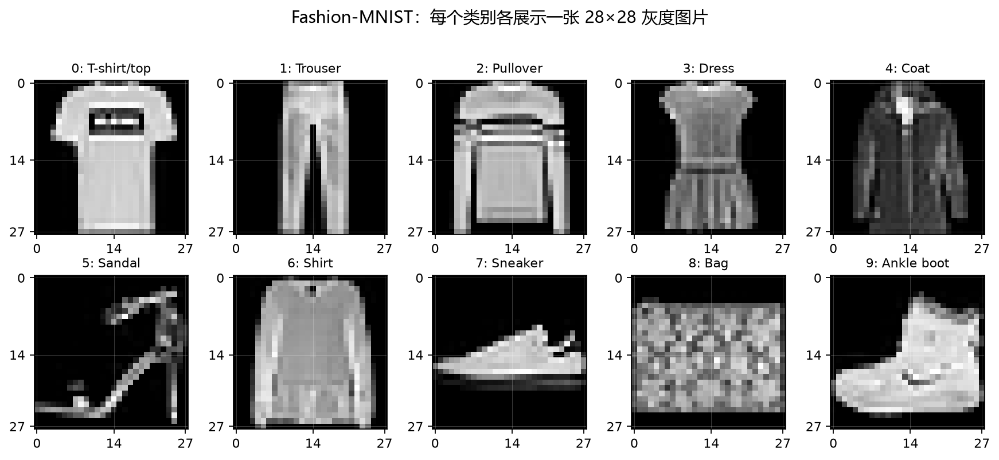
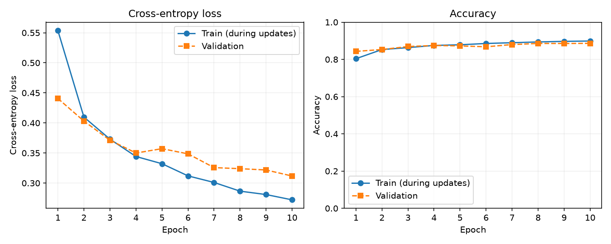
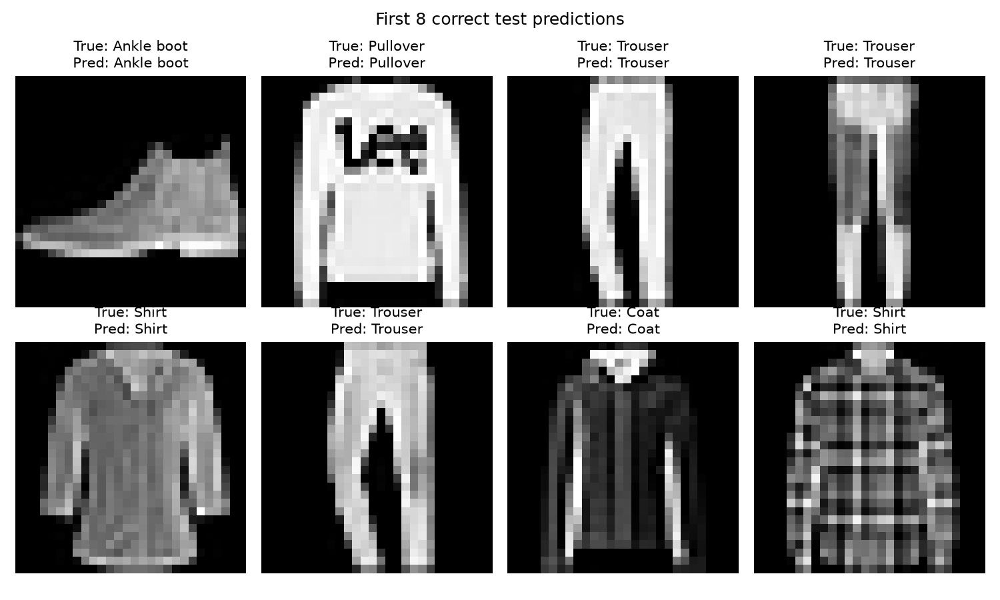
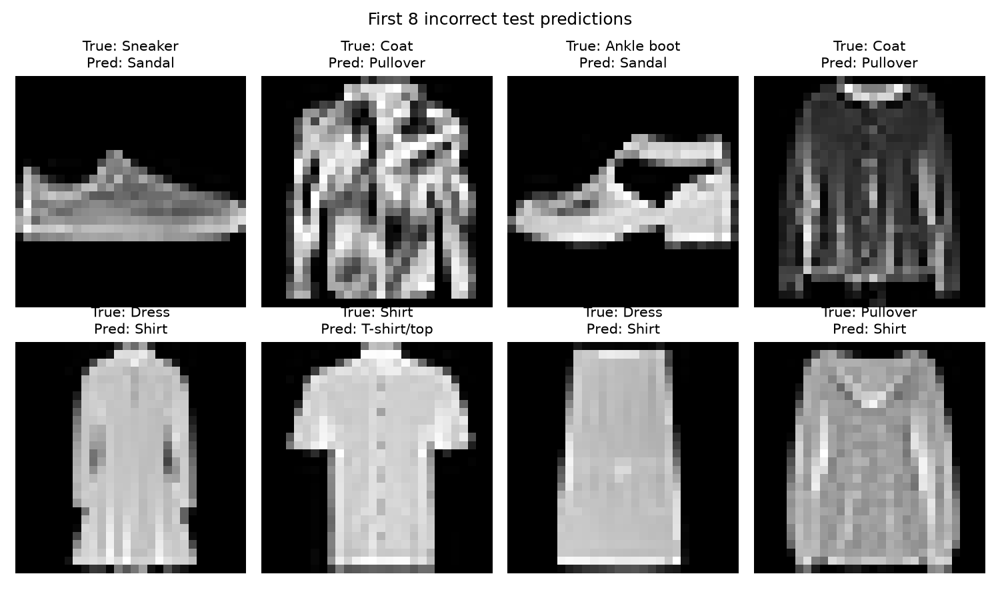

## 本周目标

这周的重点是跑通一个完整的图像分类流程：拿到图片，送进模型，计算预测错误程度，再更新参数，最后用测试图片检查效果。项目同时保存模型文件、训练曲线和预测样例，让结果可以复查。

## Fashion-MNIST 到底是什么

Fashion-MNIST 是一个服饰图片分类数据集。每张图片是 **28×28 像素、单通道灰度图**，所以一张图片可以表示成形状为 `[1, 28, 28]` 的张量。像素原始值是 0 到 255：0 接近黑色，255 接近白色。代码先用 `ToTensor()` 把它缩放到 0 到 1，再用固定均值和标准差缩放到大约 -1 到 1。

下面每个类别各展示一张样例。坐标轴上的 0、14、27 对应 28 个像素位置。这些图片是灰度图，模型输入是一组灰度数字。



数据一共有 10 类，标签编号如下：

| 标签 | 英文名称 | 含义 |
| ---: | --- | --- |
| 0 | T-shirt/top | T 恤或上衣 |
| 1 | Trouser | 长裤 |
| 2 | Pullover | 套头衫 |
| 3 | Dress | 连衣裙 |
| 4 | Coat | 外套 |
| 5 | Sandal | 凉鞋 |
| 6 | Shirt | 衬衫 |
| 7 | Sneaker | 运动鞋 |
| 8 | Bag | 包 |
| 9 | Ankle boot | 短靴 |

官方数据包含 60,000 张训练图片和 10,000 张测试图片。我的代码又从训练部分固定划出 6,000 张作为验证集，因此实际划分是：54,000 张训练、6,000 张验证、10,000 张测试。训练集用于改参数，验证集用于观察训练过程，测试集留到最后做一次最终检查。

## 这次用了哪些模型

### MLP：先把图片当作向量

MLP 是 **Multi-Layer Perceptron，多层感知机**。这次的 MLP 结构很简单：

```text
[1, 28, 28]
    ↓ Flatten
[784]
    ↓ Linear(784, 128) + ReLU
[128]
    ↓ Dropout(0.1)
[128]
    ↓ Linear(128, 10)
[10 个类别分数]
```

`Flatten` 把 28×28 的图片摊平成 784 个数字。`Linear` 层做加权求和并加偏置；这些权重就是训练过程中要学习的参数。

**ReLU** 是一种激活函数，定义为 `max(0, x)`：负数变成 0，正数保持不变。多层线性层叠起来可以合并成一个线性变换，ReLU 为网络加入非线性表达能力。

**Dropout(0.1)** 训练时随机暂时关闭约 10% 的隐藏单元，减少模型只记住训练样本的风险。验证和测试时会自动关闭 Dropout，所以评估结果更稳定。

### CNN：为图像准备的下一步

CNN 是 **Convolutional Neural Network，卷积神经网络**。卷积层用小窗口在图片上滑动，学习边缘、纹理和局部形状；池化层缩小空间尺寸，减少计算量。这比直接把像素全部摊平更贴近图像的结构。

项目中的 `SmallCNN` 有两层卷积和两次最大池化，最后接全连接层。它作为 MLP 之后的对比实验，MLP 主流程已经完成。可以这样运行：

```powershell
.\.venv\Scripts\python.exe -m src.train --model cnn --epochs 3
```

## 从 batch 到参数更新：一次训练循环

### 1. Batch 是什么

一个 batch 是一次送进模型的一小批样本。本次 `batch_size=128`，所以大多数 batch 的图片张量形状是 `[128, 1, 28, 28]`，标签形状是 `[128]`。一次只处理 128 张图片，可以控制内存，也比一张一张更新更稳定。

### 2. 前向传播和 logits

模型读取图片并输出 `[128, 10]` 的 **logits**。logits 是模型直接输出的原始分数，例如某张图片可能得到：

```text
[-1.2, 0.3, 2.8, 0.1, -0.4, ...]
```

第 2 个位置分数最高，代表模型暂时最倾向于类别 2 Pullover。交叉熵损失可以直接接收 logits，并在内部完成适合计算的归一化。代码直接把 logits 传给损失函数。

### 3. Loss 衡量错得有多严重

**Loss（损失）** 是一个数，用来衡量模型预测和真实标签之间的差距。本次使用 `CrossEntropyLoss`：真实类别分数越低，损失通常越大；真实类别分数越高，损失通常越小。准确率只回答“猜对还是猜错”，loss 还会反映模型对错误预测的确信程度。

### 4. 为什么调用 `loss.backward()`

模型里有很多权重。我们需要知道每个权重向哪个方向变化能让 loss 变小。`loss.backward()` 使用 PyTorch 的自动微分机制，沿着前向传播建立的计算图反向计算偏导数，把每个参数的梯度保存到 `parameter.grad` 中。

可以把梯度理解成“loss 对这个参数有多敏感”：梯度为正，参数略微减小可能让 loss 降低；梯度为负，参数略微增大可能更有帮助。`backward()` 只计算梯度，本身还不会更新权重。

### 5. Adam 优化器和 `optimizer.step()`

**Adam** 是一种常用的优化器。它会利用当前梯度，并维护梯度的一阶和二阶移动平均，为不同参数自动调整步长。相比手动给每个权重写更新公式，Adam 让这个过程更方便。

`optimizer.step()` 才会根据梯度真正修改模型参数。每个 batch 开始前先调用 `optimizer.zero_grad()`，清空上一批留下的梯度，否则 PyTorch 默认会把梯度累加。

训练循环的核心代码可以压缩成：

```python
optimizer.zero_grad()
logits = model(images)          # 前向传播
loss = criterion(logits, labels)
loss.backward()                 # 计算梯度
optimizer.step()                # 更新参数
```

## 实现细节

`Dataset` 负责“按索引取出一条样本”，`DataLoader` 负责把样本组成 batch，并在训练集上打乱顺序。`random_split` 使用固定种子 42 划分训练集和验证集，因此重复运行时划分保持稳定。

每个 epoch 中，模型先在训练集上更新参数，再切换到 `eval()` 模式，在验证集上计算 loss 和准确率。验证阶段使用 `torch.no_grad()`，不保存梯度，也不更新参数。代码保存验证准确率最高的 checkpoint，最后重新加载这个最佳 checkpoint 评估测试集。

随机种子同时用于 Python、NumPy 和 PyTorch。实际运行设备是 CPU，线程数为 4。训练曲线和指标由代码直接写入 `outputs/mlp/`，博客中的数字直接来自 `metrics.json`。

## 实际结果

本次 MLP 实验配置：10 个 epoch、batch size 128、学习率 0.001、Adam、随机种子 42。训练集准确率从第 1 个 epoch 的 80.37% 上升到第 10 个 epoch 的 89.87%；验证集准确率从第 1 个 epoch 的 84.30% 上升到第 10 个 epoch 的 88.62%。最佳 checkpoint 出现在第 10 个 epoch。

最终测试集结果：

```text
test_loss     = 0.3347
test_accuracy = 0.8825（88.25%）
```

下面的曲线比单独看一个准确率更直观：训练和验证 loss 总体下降，准确率总体上升。第 5、6 个 epoch 的验证准确率有短暂波动，但后面继续提升，说明增加训练轮数对这次实验有帮助。



## 看几个具体预测

代码从测试集保存了前几张预测正确和预测错误的图片。每张图的标题同时给出真实类别和预测类别；绿色标题表示相同，红色标题表示不同。





错误样例比准确率更能说明问题：服饰图片很小、是灰度图，而且 `Shirt`、`T-shirt/top`、`Pullover` 和 `Coat` 的轮廓可能相似。MLP 只看到展平后的像素，容易把这些类别混淆；这也是 CNN 可能带来帮助的地方。

## 我遇到的问题

第一次运行时，torchvision 默认的 Fashion-MNIST HTTP 地址连接被拒绝。后来从 Fashion-MNIST 官方仓库的 HTTPS raw 镜像下载四个 gzip 文件，放到 `data/FashionMNIST/raw/` 后，torchvision 能正常读取，训练顺利完成。

此外，第一次生成图表时 Matplotlib 尝试写入用户目录缓存，出现权限提示；图像文件和训练结果正常生成。核心代码通过 `python -m compileall src scripts` 静态检查通过。

## 这一周真正理解了什么

我现在能把一个分类项目拆成几个具体步骤：图片和标签先由 Dataset 提供，DataLoader 组成 batch；模型前向产生 logits；loss 衡量预测与标签的差距；`backward()` 计算每个参数的梯度；Adam 根据梯度更新参数；验证集帮助观察泛化，测试集用于最后一次独立检查。

这次最重要的收获是理解这些概念如何在一段训练循环中连接起来，并能用曲线、模型文件和具体预测图片检查结果。


